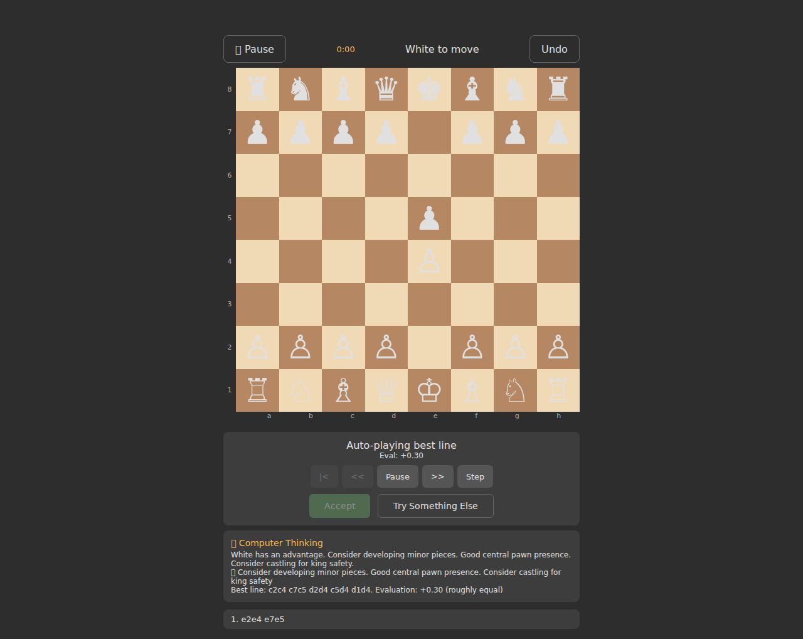
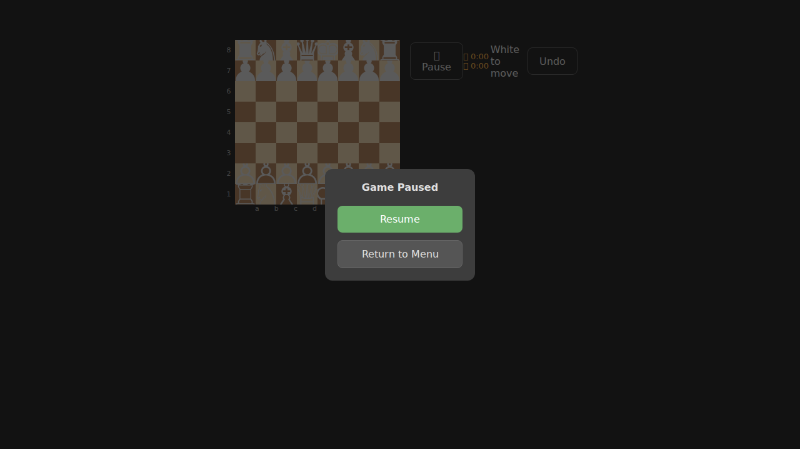

# ♔ GhostChess

A chess simulator with a unique **ghost "perfect play" preview** — after you make a move, the engine shows you what the next best moves would look like as semi-transparent ghost pieces. You can step through the predicted line, accept it, or dismiss it and try something else.

Built with **Kotlin Multiplatform** (Android + Web) using Compose Multiplatform for the Android UI and a DOM-based Kotlin/JS frontend for the web.

## Screenshots

| Main Menu | Board | Piece Selected |
|:-:|:-:|:-:|
|  |  |  |

| Ghost Preview | Engine Thinking | Pause Menu |
|:-:|:-:|:-:|
|  |  |  |

## Features

- **Ghost Preview** — After each move, the engine calculates the best continuation and displays it as ghost pieces on the board. Step through moves one by one, auto-play them, or accept/dismiss the line.
- **Engine Thinking** — Toggle an analysis panel that shows the engine's evaluation, threats, and strategic notes.
- **Difficulty Levels** — Easy, Medium, and Hard affect engine search depth.
- **Win/Loss Tracking** — Per-difficulty win/loss record persisted via localStorage.
- **Move Timer** — Tracks time spent on each move.
- **Pause Menu** — Pause the game and resume or return to the main menu.
- **Infinite Undo** — Undo any number of moves.
- **Pawn Promotion** — Modal picker for queen, rook, bishop, or knight.
- **Two Game Modes** — Play vs the engine or pass-and-play vs a human.

## Getting Started

### Prerequisites

- **JDK 17+** (for building)
- **Android SDK** (for the Android APK)
- **Node.js 18+** (for E2E tests)

### Build the Web App

```bash
./gradlew :webApp:jsBrowserDevelopmentExecutableDistribution
```

Serve locally:

```bash
cd webApp/build/dist/js/developmentExecutable
python3 -m http.server 8080
```

### Build the Android APK

```bash
./gradlew :composeApp:assembleDebug
```

The APK is output to `composeApp/build/outputs/apk/debug/composeApp-debug.apk`.

A pre-built APK is also available at [`chess-simulator-debug.apk`](chess-simulator-debug.apk).

### Run Unit Tests

```bash
./gradlew :shared:jvmTest
```

### Run E2E Tests

```bash
cd e2e
npm install
npx playwright install chromium
npx playwright test
```

## Project Structure

```
shared/                  # Kotlin Multiplatform shared module
  src/commonMain/
    chess/core/          # Board, Move, MoveGenerator, GameState
    chess/engine/        # ChessEngine interface, SimpleEngine
    chess/ghost/         # GhostPreviewManager
    chess/game/          # GameSession, GameConfig, Difficulty
  src/commonTest/        # 155 unit tests

composeApp/              # Compose Multiplatform (Android + Wasm)
  src/commonMain/        # Compose UI (ChessBoard, GhostControls, App)
  src/androidMain/       # Android entry point (MainActivity)

webApp/                  # Kotlin/JS web frontend (DOM-based)
  src/jsMain/            # Main.kt + index.html

e2e/                     # Playwright E2E test suite
  tests/
    chess.spec.ts        # Menu & game screen tests
    gameplay.spec.ts     # Moves, captures, undo, checkmate tests
    opening-moves.spec.ts # All 20 opening moves, ghost regression
    screenshots.spec.ts  # Screenshot generation tests
```

## Test Coverage

- **155 unit tests** — Chess rules, move generation, engine evaluation, ghost preview, game session, checkmate detection
- **75 E2E tests** — Menu, board display, gameplay, ghost preview flow, all 20 opening moves with deterministic engine verification, checkmate scenarios, ghost accept regression, screenshot generation

## Tech Stack

- **Kotlin 2.1.0** / **Kotlin Multiplatform**
- **Compose Multiplatform 1.7.3** (Android UI)
- **Kotlin/JS** (Web UI via DOM manipulation)
- **Playwright** (E2E testing)
- **Gradle 8.10**

## License

This project is licensed under the **GNU General Public License v3.0** — see the [LICENSE](LICENSE) file for details.
