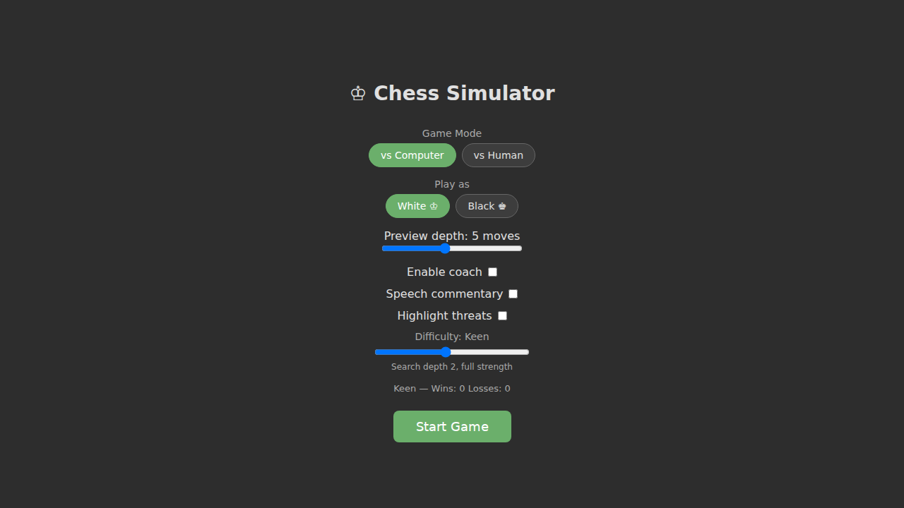
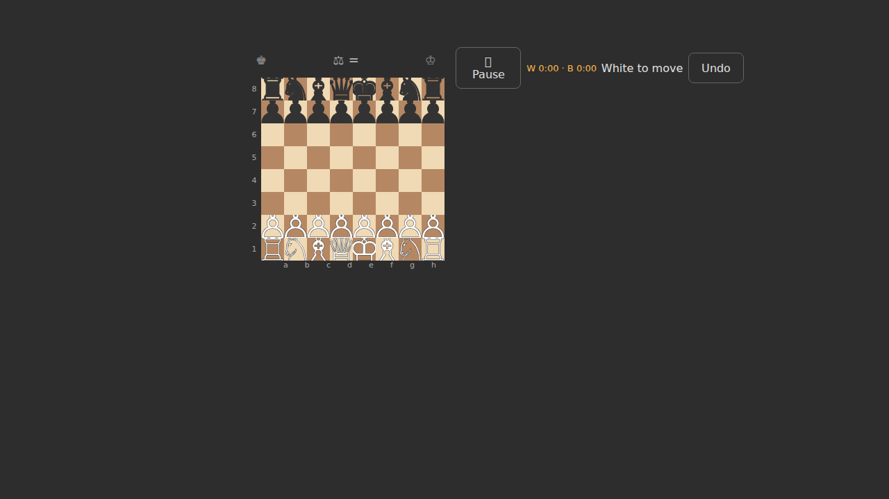
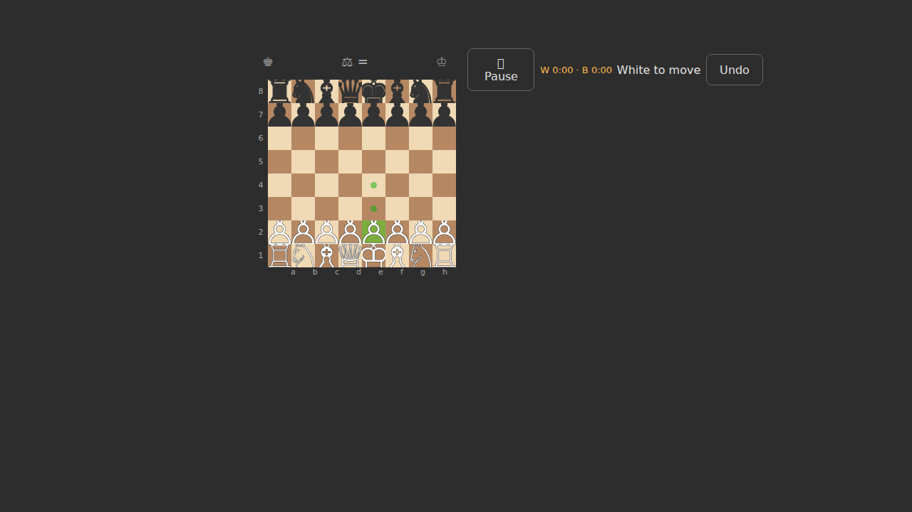
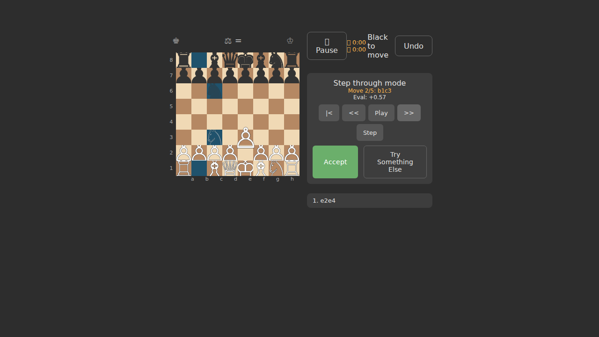
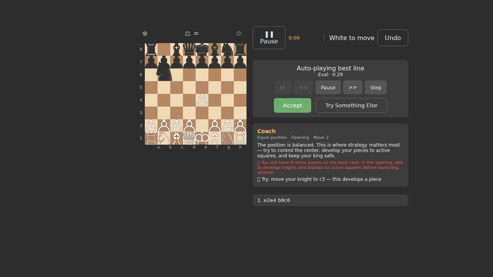
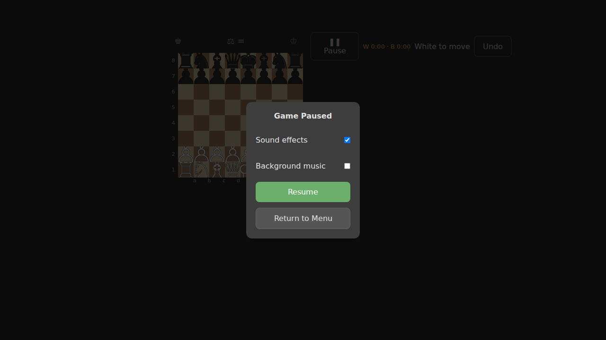

# ♔ GhostChess

A chess teaching app with a unique **ghost "perfect play" preview** — after you make a move, the engine shows you what the next best moves would look like as semi-transparent ghost pieces. A built-in **coach** explains the position, highlights risks, and suggests your best move with reasoning.

Built with **Kotlin Multiplatform** (Android + Web) using Compose Multiplatform for the Android UI and a DOM-based Kotlin/JS frontend for the web.

## Gameplay Demo

<p align="center">
  
</p>

*Scholar's Mate in 4 moves — showing ghost previews, coaching, and checkmate detection.*

## Screenshots

| Main Menu | Board | Piece Selected |
|:-:|:-:|:-:|
|  |  |  |

| Ghost Preview | Coach Panel | Pause Menu |
|:-:|:-:|:-:|
|  |  |  |

## Features

### Teaching & Coaching
- **Coach Panel** — Real-time lessons explaining *why* a position is good or bad, what to watch for, and what to do next. Tips cover hanging pieces, castling, development, and center control.
- **Move Suggestions** — The coach suggests your best move with reasoning (e.g. "Try: move your knight to f3 — this develops a piece").
- **Threat Highlights** — Toggle orange highlights on your attacked pieces and green on opponent's undefended pieces.
- **Speech Commentary** — Optional text-to-speech banter that reacts to captures, checks, forks, blunders, and more — with correct perspective ("my pawn" vs "your pawn").

### Gameplay
- **Ghost Preview** — After each move, the engine calculates the best continuation and displays it as ghost pieces. Step through moves, auto-play them, or accept/dismiss the line.
- **12 Difficulty Levels** — From "Clueless" to "Ruthless", with descriptive names and scaled engine strength.
- **Animated Engine Moves** — Computer moves animate with the same lift-slide-land animation as ghost previews.
- **Fork & Win Detection** — Banter commentary for forks and when one side has a guaranteed win.
- **Move Timer** — Tracks time spent per side.
- **Pause Menu** — Pause the game and resume or return to the main menu.
- **Infinite Undo** — Undo any number of moves (undoes both your move and the engine's response).
- **Pawn Promotion** — Modal picker for queen, rook, bishop, or knight.
- **Two Game Modes** — Play vs the engine or pass-and-play vs a human.

### Engine
- Custom **minimax engine with alpha-beta pruning** and quiescence search
- **Piece-square tables** for positional awareness
- **King safety** evaluation (pawn shield)
- **Mobility scoring** for both sides
- Move ordering for efficient search (MVV-LVA captures, promotions first)

## Getting Started

### Prerequisites

- **JDK 17+** (for building)
- **Android SDK** (for the Android APK)
- **Node.js 18+** (for E2E tests)

### Build the Web App

```bash
./gradlew :webApp:jsBrowserDevelopmentExecutableDistribution
```

Serve locally:

```bash
cd webApp/build/dist/js/developmentExecutable
python3 -m http.server 8080
```

### Build the Android APK

```bash
./gradlew :composeApp:assembleDebug
```

The APK is output to `composeApp/build/outputs/apk/debug/composeApp-debug.apk`.

A pre-built APK is available from the [latest release](https://github.com/IanNorris/GhostChess/releases/latest). You can also trigger a build manually from the **Actions** tab.

### Run Unit Tests

```bash
./gradlew :shared:jvmTest
```

### Run E2E Tests

```bash
cd e2e
npm install
npx playwright install chromium
npx playwright test
```

## Project Structure

```
shared/                  # Kotlin Multiplatform shared module
  src/commonMain/
    chess/core/          # Board, Move, MoveGenerator, GameState
    chess/engine/        # ChessEngine interface, SimpleEngine (minimax + alpha-beta)
    chess/ghost/         # GhostPreviewManager
    chess/game/          # GameSession, GameConfig, Difficulty, GameSummary
    chess/speech/        # BanterLines, CommentaryGenerator, GameCommentator, GameEvents
  src/commonTest/        # Unit tests

composeApp/              # Compose Multiplatform (Android)
  src/commonMain/        # Compose UI (ChessBoard, GhostControls, GameSummaryPanel, App)
  src/androidMain/       # Android entry point (MainActivity, TTS engine)

webApp/                  # Kotlin/JS web frontend (DOM-based)
  src/jsMain/            # Main.kt + index.html

e2e/                     # Playwright E2E test suite
  tests/
    chess.spec.ts        # Menu & game screen tests
    gameplay.spec.ts     # Moves, captures, undo, checkmate tests
    opening-moves.spec.ts # All 20 opening moves, ghost regression
    screenshots.spec.ts  # Screenshot generation tests
```

## Test Coverage

- **155+ unit tests** — Chess rules, move generation, engine evaluation, ghost preview, game session, checkmate detection
- **75+ E2E tests** — Menu, board display, gameplay, ghost preview flow, all 20 opening moves with deterministic engine verification, checkmate scenarios, ghost accept regression, screenshot generation

## Tech Stack

- **Kotlin 2.1.0** / **Kotlin Multiplatform**
- **Compose Multiplatform 1.7.3** (Android UI)
- **Kotlin/JS** (Web UI via DOM manipulation)
- **Playwright** (E2E testing)
- **Gradle 8.10**

## License

This project is licensed under the **GNU General Public License v3.0** — see the [LICENSE](LICENSE) file for details.
